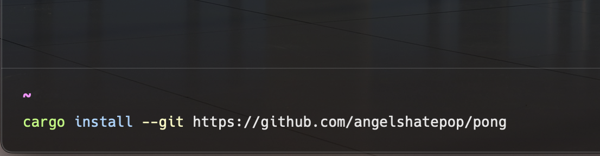

# Pong
an modern implementation of the classic game in Rust using Bevy"0.9.1" and Clap"4.1.8"

## How to Install?
as of now, the only way to install is by this repositories link,

## How to Play?
controls:
- **Player**: W and S to move Up and Down along Y-axis
- **Player2r**: Up(Arrow) and Down(Arrow) to move Up and Down along Y-axis

there are only two gamemodes in the current version:
- **Player V CPU**: Verse the CPU as it gradually grows stronger throughout the match
- **Player V Player**: Local 1v1 Pong

## License

Pong is **open source** and licensed under:
